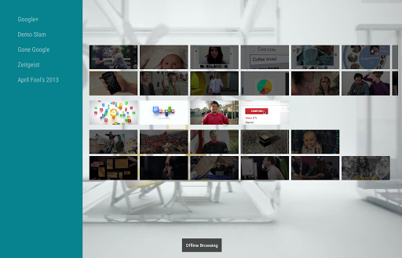
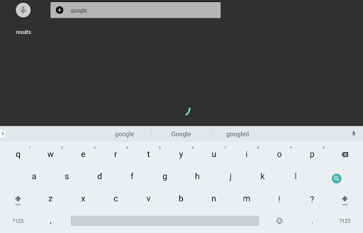

# Architecture Components with Leanback

## Overview 

This app is used to demonstrate how to persist data to local database or sd card (based on the data type). To make the tv app ready for offline usage.

In our sample app, we use [Room Database](https://developer.android.com/topic/libraries/architecture/room.html) as the database and ui controller will observe database's status leveraging [LiveData](https://developer.android.com/topic/libraries/architecture/livedata.html) and [ViewModel](https://developer.android.com/topic/libraries/architecture/viewmodel.html) to update the ui automatically and reactively once the content in the database has been modifed or updated.


To be more specific, when the app is firstly launched under network available environment, it will fetch and persist the json data (including video's title, video's URL) to room database. So under the circumstance where network is unavailable, those basic information will still be presented to user instead of leaving a blank page which will impair the user experience.

To enable full offline access, in our app user can long click the video item and choose to download that video including video content, background and card image through the pop up menu. Once it is downloaded, the paths point to those local contents will be updated to database accordingly.

## Technical Details
Firstly, regarding the interaction with database, the query result from [Room Database](https://developer.android.com/topic/libraries/architecture/room.html) is represented as [LiveData](https://developer.android.com/topic/libraries/architecture/livedata.html) and is encapsulated inside of a [ViewModel](https://developer.android.com/topic/libraries/architecture/viewmodel.html). So the data can survive though the configuration changes as long as the Life cycle owner is not destroyed.

Also through leveraging [MediatorLiveData](https://developer.android.com/reference/android/arch/lifecycle/MediatorLiveData.html) we can return the query result from database with specified delay. The artificial delay is disabled on default, but user can enable it easily by modifying the flag in AppConfiguration.java file.

The delay is designed to simulate several scenarios including: 

1. Fetching data from Internet with high network latency. 

    Network's bandwidth can easily becomes a bottleneck for almost every application which needs to sync with internet resource frequently. It is always a good practice to consider it before hand. Through [MediatorLiveData](https://developer.android.com/reference/android/arch/lifecycle/MediatorLiveData.html), the artificial delay can be enabled easily and for developer to observe and think about the solution to handle this situation.

2. Accessing Massive database. 

    In this app, the dataset is relatively small, but the actual database can be huge. In that case, the delay for querying operation is unavoidable. Through introducing the artificial delay happens in database accessing stage, it can help us scaling the application without the request for massive data set.

The adoption of [LiveData](https://developer.android.com/topic/libraries/architecture/livedata.html) also enables the whole reactive architecture. For example, network connectivity status is represented using a [LiveData](https://developer.android.com/topic/libraries/architecture/livedata.html), through observing it. Our application can react the network status change immediately including notifying user current network's condition.

Another benefits by using [LiveData](https://developer.android.com/topic/libraries/architecture/livedata.html) is Application's states can be shared with different UI components easily. In this sample app, since the video can be downloaded/ removed/ rented, so each video will have several different states including (downloading/ removing/ rented/ downloaded/ removed etc). Traditional method to sync those states may requires nested callbacks/ listeners which can obscure the code structure. But through subscribing LiveData and persisting all information to the same database. The state issue can be dealt with easily and clearly. Different UI controller (presenter or fragment) can observe the same data source and update UI without interfering each other.

Finally to update UI efficiently, a new adapter is created which uses DiffUtil to compare and compute the difference between two data sets and dispatch those difference with animation support.

## key features

1. Automatically re-fetching data when network becomes available.

    Through subscribing the network status live data, our application can setup the database immediately when network becomes available if the database has not been set up.

2. Easy to configure.

    The user can change app configuration easily by modifying the default flag defined in [AppConfiguration.java](./app/src/main/java/android/support/v17/leanback/supportleanbackshowcase/app/room/config/AppConfiguration.java) to enable the artificial latency for different purposes, developers then can use it as the clue to tune the performance and design a cache layer before interacting with network resource or database directly.

    The configurations we currently support have been listed below, which are all disabled on default.


    ```java
    public class AppConfiguration {

    // Simulate database accessing latency.
    public static boolean IS_DATABASE_ACCESS_LATENCY_ENABLED = false;

    // Simulate network accessing latency.
    public static boolean IS_NETWORK_LATENCY_ENABLED = false;

    // Simulate file operation latency. (Happens when user need to delete downloaded contents)
    public static boolean IS_FILE_OPERATION_LATENCY_ENABLED = false;

    // Simulate renting transaction latency. (Happens when user rent a video)
    public static boolean IS_RENTING_OPERATION_DELAY_ENABLED = false;

    // Simulate searching latency.
    public static boolean IS_SEARCH_LATENCY_ENABLED = false;

    // Only use a small data set (live_movie_debug.json) for debugging
    public static boolean IS_DEBUGGING_VERSION = false;
    }
    ```

3. Reactive Search Supported.

    The query field is encapsulated as a [LiveData](https://developer.android.com/topic/libraries/architecture/livedata.html), The search result will be changed reactively according to user's input.

## screen shots

### React to network status. 




### Sharing States


### Searching Videos




